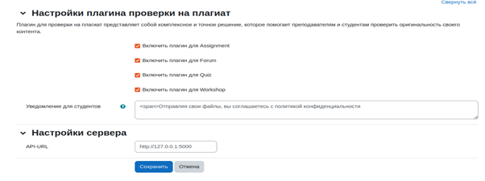

Plagkh Плагин проверки на плагиат для Moodle 3.5+
===========================================================================

Plagkh Средство проверки на плагиат — это простая и удобная в использовании система интеграции, которая тщательно сканирует студенческие задания прямо с платформы на наличие плагиата. Все представленные проекты и исследовательские работы могут быть быстро просмотрены с ваших платформ LMS во время процедуры оценивания. Средство проверки на плагиат plagkh создаст отчет о сходстве и подробный результат для преподавателей, чтобы они могли проверить наличие скопированного содержимого в исследовательской или научной статье.

Поддерживаемые модули
-----------------------------------------

- Assignment
- Forum
- Workshop
- Quiz[^1]

Установка
------------------

- Во-первых, убедитесь, что вы используете Moodle 3.5 или выше.
- Чтобы плагин работал, вам нужно запустить задание cron Moodle.
- Для начала устанавливается сам плагин и включается проверка на плагиат.
- 
- Настраивается плагин
- 
- Настраивается проверка  в задании
- 
- Запускается проверка при отправке задания
- 
- 

---

[^1]: Quizzes доступен в Moodle 3.11+.
